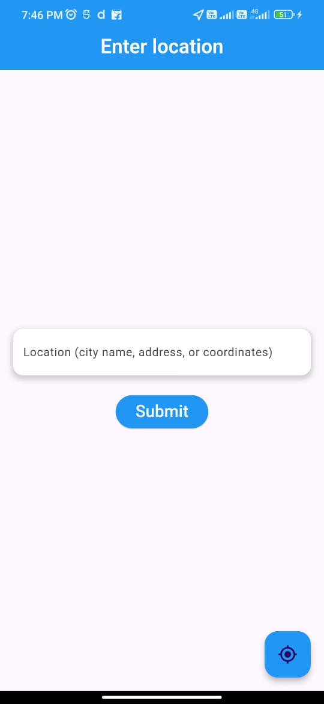
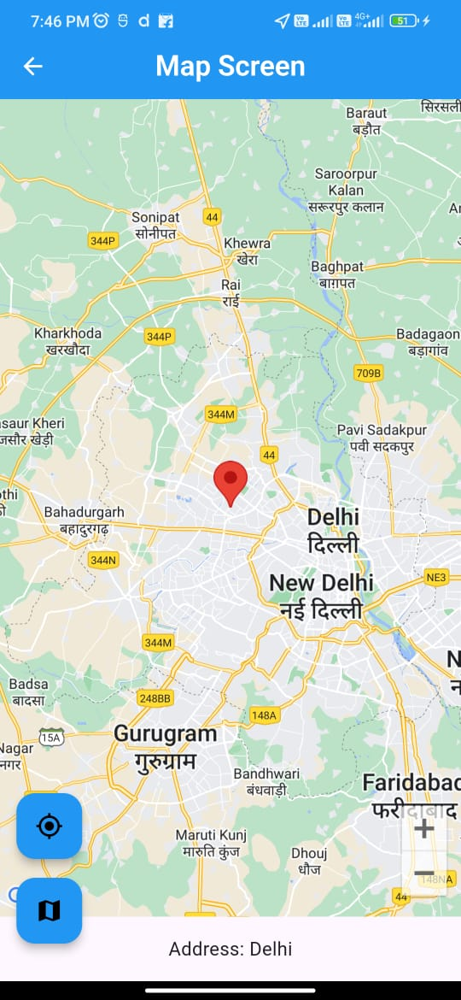
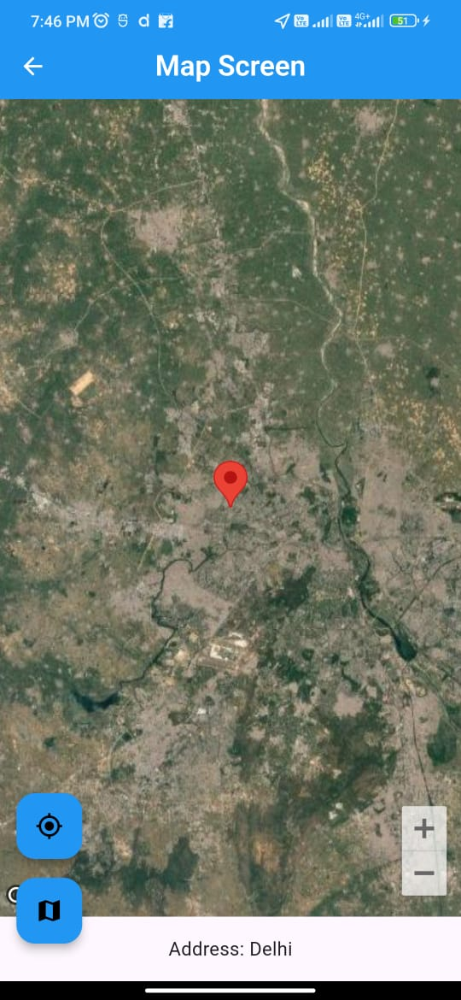
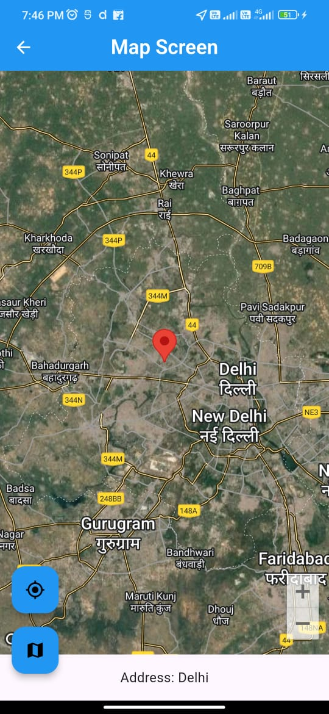
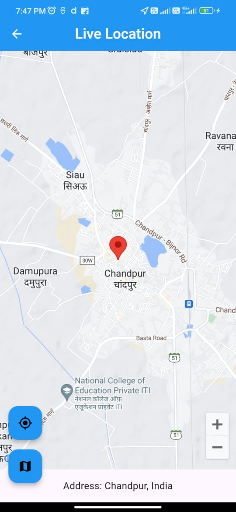
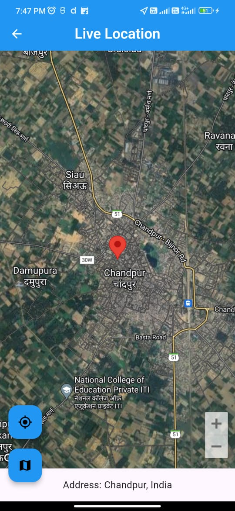
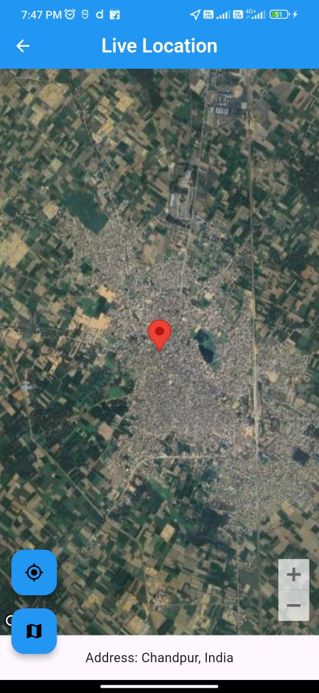

# Map Location App

This Flutter app allows users to input a location manually or fetch their current live location. The app displays the location on a map and provides additional features like switching between different map types (satellite, terrain, etc.).

## Features

- Input location manually (city name, address, or coordinates).
- Fetch and display live location on the map.
- Switch between different map types (normal, satellite, terrain).
- Displays address based on live location.

## Screenshots

### Location Input Screen


### Location Input Screen




### Live Location Screen




## Setup Instructions

### Prerequisites

- Install [Flutter SDK](https://flutter.dev/docs/get-started/install).
- Install [Android Studio](https://developer.android.com/studio) or [Visual Studio Code](https://code.visualstudio.com/) with the Flutter extension.
- Install necessary platform tools for running the app on your desired platform (Android/iOS).

### Installation Steps

1. Clone the repository:

   ```bash
   git clone https://github.com/yourusername/map_location_app.git
   cd map_location_app

2. Install dependencies:
   flutter pub get

3. Connect a physical device or start an emulator.

4. Run the app: flutter run
